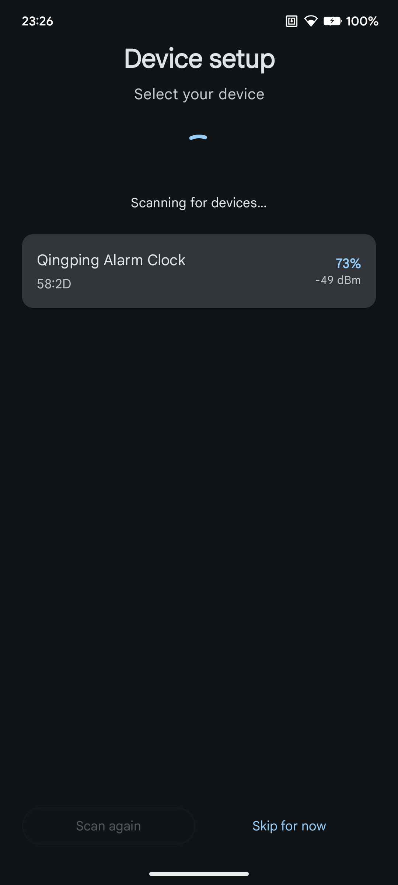
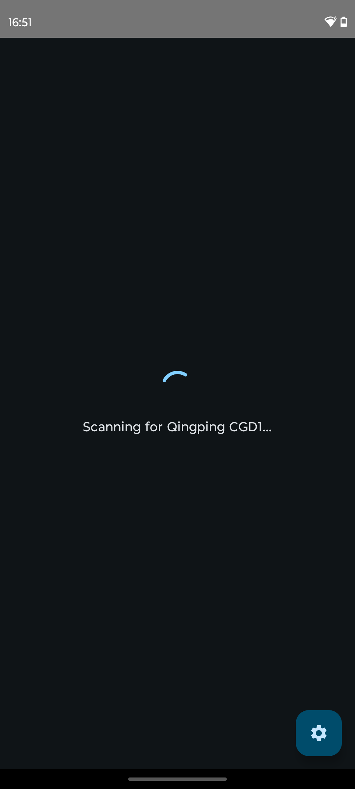
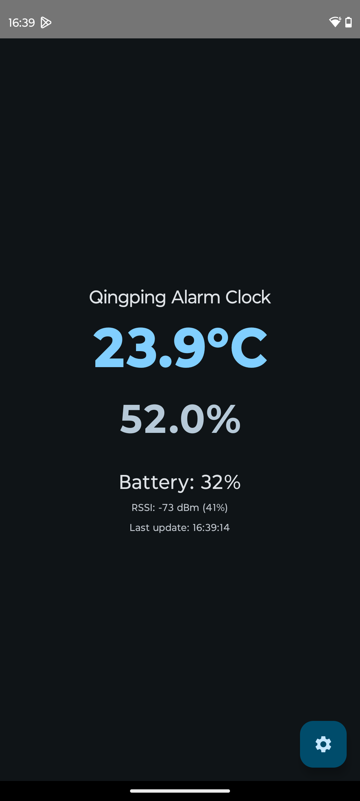
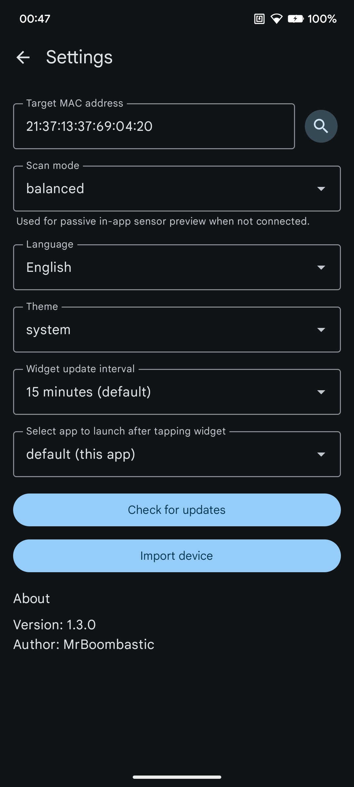

# bUwUdzik

Android app for displaying data from the Qingping CGD1 - Bluetooth LE alarm
clock with sensors.

## Warning

App was partially created using LLMs. I still have reviewed the code,
so it's only semi-slop, but you have been warned, etc., etc.

## Features

* Scans for a specific Bluetooth LE device by its MAC address.
* Parses and displays sensor data.
* Management of up to 16 device alarms (on-device storage).
* In-app support for creating and deleting device alarms.
* **Global alarm switch** to enable or disable all device alarms at once.
* Bluetooth state monitoring with automatic prompts to enable it.
* Interactive real-time previews for brightness and volume settings.
* Widget for displaying the latest sensor data on the home screen.
* Configurable background updates to fetch data periodically.
* Settings to customize the device's MAC address, theme (light/dark/system), and language.
* Initial setup screen to guide the user through finding and selecting their device.

## Technical Details

The application is built with modern Android development technologies and targets recent Android
versions.

* **Target API:** The application targets Android 16 (API level 36) and has a minimum requirement of
  Android 14 (API level 34).
* **UI:** Jetpack Compose for a declarative and modern UI.
* **Bluetooth LE:** It uses Android's native Bluetooth LE scanner to listen for advertisement
  packets from the sensor. It filters for devices advertising the specific service UUID
  `0000fdcd-0000-1000-8000-00805f9b34fb`.
* **Data Parsing:** The sensor data is extracted from the service data field of the advertisement
  packet. The custom data format is as follows:
    * Byte 1: Device ID (must be `0x0C` for CGD1)
    * Bytes 10-11: Temperature (16-bit Little Endian signed integer, divided by 10)
    * Bytes 12-13: Humidity (16-bit Little Endian unsigned integer, divided by 10)
    * Byte 16: Battery level (unsigned 8-bit integer)
* **Background Processing:** `WorkManager` and `AlarmManager` for scheduling periodic data fetches,
  ensuring the widget is always up-to-date.

## Screenshots

### Setup screen

### Waiting for the data

### Main screen

### Settings screen

### Widget on home screen

## Protocol Specification

This section describes the reverse-engineered Bluetooth Low Energy (BLE) protocol for the Qingping
CGD1 Alarm Clock.

### 1. Service & Characteristics Profile

The device uses a custom service structure but relies on standard 128-bit base UUIDs for
characteristics in this specific firmware version.

**Target Service UUID:** `22210000-554a-4546-5542-46534450464d` (Advertised)

| Function      | Characteristic UUID                    | Properties |
|---------------|----------------------------------------|------------|
| Auth Write    | `00000001-0000-1000-8000-00805f9b34fb` | Write      |
| Auth Notify   | `00000002-0000-1000-8000-00805f9b34fb` | Notify     |
| Data Write    | `0000000b-0000-1000-8000-00805f9b34fb` | Write      |
| Data Notify   | `0000000c-0000-1000-8000-00805f9b34fb` | Notify     |
| Sensor Notify | `00000100-0000-1000-8000-00805f9b34fb` | Notify     |

### 2. Authentication (Magic Replay Method)

The device accepts a static, captured authentication packet ("Magic Packet"), effectively allowing a
Replay Attack to bypass the need for dynamic BindKey encryption.

**Flow:**

1. Connect to the device.
2. Enable Notifications on **Auth Notify** (...0002).
3. Write the **Magic Packet** to **Auth Write** (...0001).

**Magic Packet (Hex):**
`11 02 b7 5a 1e 4e 73 70 e3 95 23 63 f7 46 ee 7c 90 09`

**Verification:** Wait for a notification on **Auth Notify**.

* **Success:** `04 ff 02 00 00` (or similar starting with `04 ff 02`)
* **Failure:** `04 ff 02 00 01`

#### 2.1. Time Synchronization

After authentication, it is recommended to synchronize the time.

* **Command (Auth Write):** `05 09 [Timestamp 4B LE]`
* **Response (Auth Notify):** `04 ff 09 00 00` (Success).

### 3. Managing Alarms

The device supports a fixed capacity of **16 alarm slots** (indexed 0-15). All alarm/settings
operations happen on the **Data** characteristics.

#### 3.1. Set Alarm

To create or modify an alarm:

* **Command:** `07 05 [ID] [Enabled] [HH] [MM] [Days] [Snooze]`

* **ID:** The alarm index (0-15).

* **Enabled:** `0x01` = On, `0x00` = Off.

* **HH, MM:** Hour (0-23) and Minute (0-59).

* **Days (Bitmask):**

    * `0x01` = Monday

    * `0x02` = Tuesday

    * `0x04` = Wednesday

    * `0x08` = Thursday

    * `0x10` = Friday

    * `0x20` = Saturday

    * `0x40` = Sunday

    * `0x00` = Once

* **Snooze:** `0x01` = On, `0x00` = Off.

#### 3.2. Delete Alarm

To delete an alarm, overwrite it with `FF` values (marking it as empty/unused).

* **Command:** `07 05 [ID] FF FF FF FF FF`

#### 3.3. Read Alarms

* **Command:** `01 06`
* **Response:** `11 06 [Base Index] [Alarm Entry 1 (5B)] ...`
* **Alarm Entry:** `[Enabled] [HH] [MM] [Days] [Snooze]`

### 4. Device Settings

Managed via a single comprehensive payload on **Data Write**.

* **Command:** Start with `13` (Set Settings) or `01 02` (Read Settings).
* **Set Settings Payload (20 bytes):**
  `13 01 [Vol] [Hdr1] [Hdr2] [Flags] [Timezone] [Duration] [Brightness] [NightStartH] [NightStartM] [NightEndH] [NightEndM] [TzSign] [NightEn] [Sig 4B]`

| Byte  | Value           | Description                                                                                                    |
|-------|-----------------|----------------------------------------------------------------------------------------------------------------|
| 0     | `0x13`          | Command ID                                                                                                     |
| 1     | `0x01` / `0x02` | Set / Read Response                                                                                            |
| 2     | `0-5?`          | Sound Volume                                                                                                   |
| 3-4   | `58 02`         | Fixed Header / Version                                                                                         |
| 5     | Bitmask         | Mode Flags: See the **Mode Flags Breakdown** table below.                                                      |
| 6     | Integer         | Timezone Offset (Units of 6 minutes)                                                                           |
| 7     | Seconds         | Backlight Duration (0=Off)                                                                                     |
| 8     | Packed          | Brightness (High nibble: Day/10, Low nibble: Night/10)                                                         |
| 9-10  | HH:MM           | Night Start Time                                                                                               |
| 11-12 | HH:MM           | Night End Time                                                                                                 |
| 13    | `0/1`           | Timezone Sign (1=Positive, 0=Negative)                                                                         |
| 14    | `0/1`           | Night Mode Enabled                                                                                             |
| 16-19 | `Sig 4B`        | Ringtone signature (4 bytes). Identifies the device ringtone — see the "Known Ringtone Signatures" list below. |

#### Mode Flags Breakdown (Byte 5)

This byte acts as a **bitfield** where individual bits control specific boolean settings.

| Bit | Value (Hex) | Description              | 0 (Off/Default) | 1 (On/Active) |
|-----|-------------|--------------------------|-----------------|---------------|
| 0   | `0x01`      | Language                 | Chinese         | English       |
| 1   | `0x02`      | Time Format              | 24-hour         | 12-hour       |
| 2   | `0x04`      | Temp Unit                | Celsius         | Fahrenheit    |
| 3   | `0x08`      | *(Reserved ?)*           | -               | -             |
| 4   | `0x10`      | Master Alarm Disable (!) | Enabled         | Disabled      |
| 5-7 | -           | *(Unused ?)*             | -               | -             |

**Workaround:** Disabling night mode is being done via setting 1-minute night mode (ie.
`00:00 - 00:01`). Yup, it's that stupid, even official app does this.

#### 4.1. Set Immediate Brightness (Preview)

* **Command (Data Write):** `02 03 [Value]`
* **Value:** Brightness level / 10 (`0-10`).
* **Response (Data Notify):** `04 ff 03 00 00` (Success).

#### 4.2. Preview Ringtone

Used to play the current or a specific volume ringtone once for testing.

* **Command (Data Write):** `01 04` (Play current) or `02 04 [Vol]` (Play at volume `1-10?`)
* **Response (Data Notify):** `04 ff 04 00 00` (Success).

### 5. Real-Time Sensor Stream

* **Target:** `00000100-...` (Notify)
* **Format:** `[00] [Temp L] [Temp H] [Hum L] [Hum H]`
* **Values:** Little Endian Int16 / 100.0.

### 6. Battery Level

* **Service UUID:** `0x180f`, **Char UUID:** `0x2a19`.
* **Format:** 1 byte (percentage).

### 7. Firmware Version

* **Command (Auth Write):** `01 0d`
* **Response (Auth Notify):** `0b [Length] [ASCII String]`

### 8. Audio Transfer Protocol (Ringtone Upload)

#### Known Ringtone Signatures

The device use these 4 bytes as a ringtone selector.

- Beep - fd c3 66 a5
- Digital Ringtone - 09 61 bb 77
- Digital Ringtone 2 - ba 2c 2c 8c
- Cuckoo - ea 2d 4c 02
- Telephone - 79 1b ac b3
- Exotic Guitar - 1d 01 9f d6
- Lively Piano - 6e 70 b6 59
- Story Piano - 8f 00 48 86
- Forest Piano - 26 52 25 19

You can upload custom tunes using your audio and bytes above, but remember to target other ID (
device can reject if same ID has different hash?).

Allows uploading 8-bit Unsigned PCM, 8000 Hz, Mono audio. Uses **BLE Reliable Write** on **Data
Write**.

1. **Start:** `08 10 [Size LE 2B] 00 [Sig 4B]` (replace `Sig 4B` with the desired ringtone signature
   from the list above)
2. **Transfer:** Send in chunks with Reliable Write.
3. **Header Injection:** Prepend `81 08` to the very first packet.
4. **Completion:** Send Execute Write Request.

### 9. Known Command IDs Summary

| Cmd | Sub | Description                             |
|-----|-----|-----------------------------------------|
| 13  | 01  | Set Settings (Volume, Brightness, etc.) |
| 02  | 03  | Set Immediate Brightness                |
| 01  | 04  | Preview Ringtone (Play Once)            |
| 07  | 05  | Set Alarm                               |
| 01  | 06  | Read Alarms                             |
| 05  | 09  | Time Sync (Timestamp)                   |
| 08  | 10  | Audio Upload Start                      |
| 01  | 0D  | Read Firmware Version                   |
